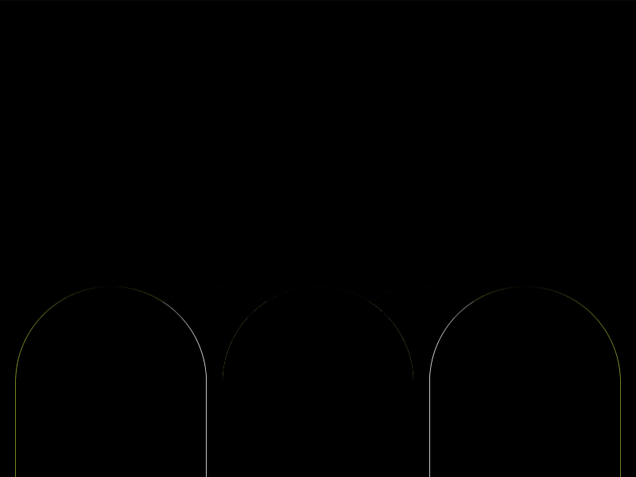

# Daily Target — Aug 29, 2026

Challenge: <https://cssbattle.dev/play/2aQnTPdW5yYCr8Ot7dZ3>

## Result

<table>
	<tr>
		<th width="50%">User Submission</th>
		<th width="50%">Target</th>
	</tr>
	<tr>
		<td width="50%" align="center">
			
		</td>
		<td width="50%" align="center">
			
		</td>
	</tr>
</table>

## Code

```html
<style>&{border-radius:9in;margin:45%140-90;color:0C0D0A;box-shadow:138q 0#FFF,-138q 0#FFF,65px 0,-65px 0,0 0 0 9in#6D57C4
```

## Prettified code

```html
<style>
& {
  border-radius: 9in;
  margin: 45% 140 -90;
  color: 0C0D0A;
  box-shadow:
    138Q 0 #fff,
    -138Q 0 #fff,
    65px 0,
    -65px 0,
    0 0 0 9in #6d57c4;
}

</style>
```
