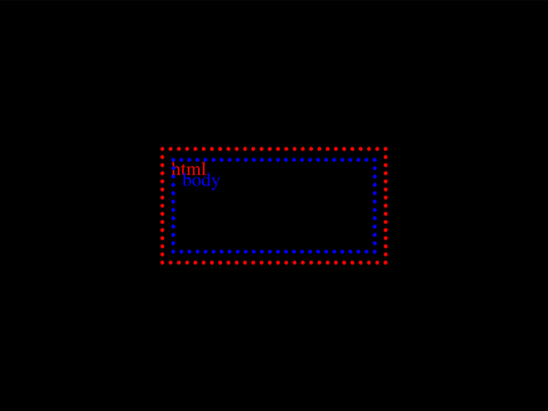

# Daily Target — Aug 30, 2026

Challenge: <https://cssbattle.dev/play/cDcn0dlBGXZ9slTUGUqf>

## Result

<table>
	<tr>
		<th width="50%">User Submission</th>
		<th width="50%">Target</th>
	</tr>
	<tr>
		<td width="50%" align="center">
			
		</td>
		<td width="50%" align="center">
			
		</td>
	</tr>
</table>

## Code

```html
<style>&{background:#57C4C4;margin:110 120;color:243D83;box-shadow:-5ch -5ch#57C4C4,5ch 5ch#57C4C4,-5ch -5ch 0 5vw,5ch 5ch 0 5vw,0 0 0 5vw
```

## Prettified code

```html
<style>
& {
  background: #57c4c4;
  margin: 110 120;
  color: 243D83;
  box-shadow:
    -5ch -5ch #57c4c4,
    5ch 5ch #57c4c4,
    -5ch -5ch 0 5vw,
    5ch 5ch 0 5vw,
    0 0 0 5vw;
}

</style>
```
