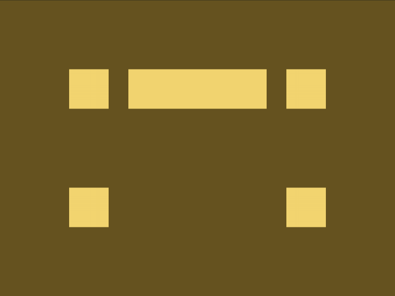
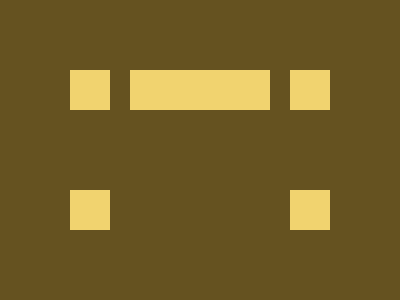

# Daily Target — Aug 31, 2026

Challenge: <https://cssbattle.dev/play/FjqC6d9FDroAnHkboFnS>

## Result

<table>
	<tr>
		<th width="50%">User Submission</th>
		<th width="50%">Target</th>
	</tr>
	<tr>
		<td width="50%" align="center">
			
		</td>
		<td width="50%" align="center">
			
		</td>
	</tr>
</table>

## Code

```html
<style>&{background:#655220;margin:70;border-image:200/5ch conic-gradient(#F1D36F);*{margin:0 60 120;background:#f1d36f
```

## Prettified code

```html
<style>
& {
  background: #655220;
  margin: 70;
  border-image: 200 / 5ch conic-gradient(#f1d36f);
  * {
    margin: 0 60 120;
    background: #f1d36f;
  }
}

</style>
```
