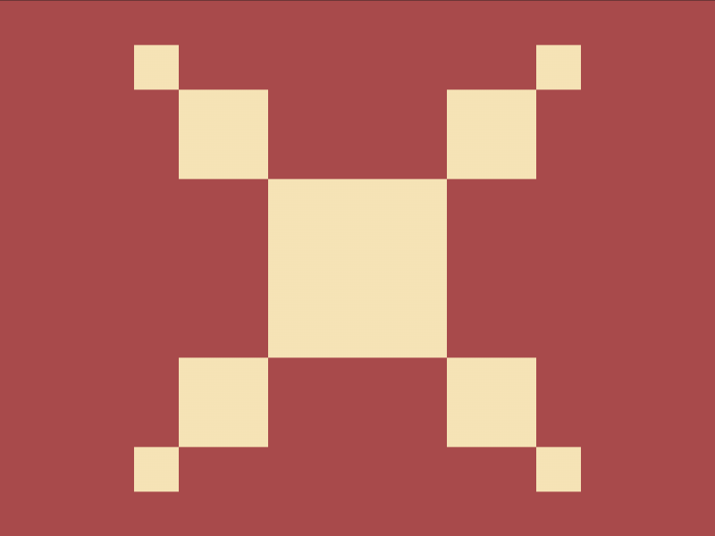

# Daily Target — Sep 2, 2026

Challenge: <https://cssbattle.dev/play/AJ9pZiNcFlllq1qpGyeW>

## Result

<table>
	<tr>
		<th width="50%">User Submission</th>
		<th width="50%">Target</th>
	</tr>
	<tr>
		<td width="50%" align="center">
			
		</td>
		<td width="50%" align="center">
			
		</td>
	</tr>
</table>

## Code

```html
<style>*{background:#a84a4b;margin:25 75;border-image:conic-gradient(#f5e3b5)200/25px}&>*{margin:75;scale:2;*{margin:25;padding:25
```

## Prettified code

```html

<style>
* {
  background: #a84a4b;
  margin: 25 75;
  border-image: conic-gradient(#f5e3b5) 200 / 25px;
}
& > * {
  margin: 75;
  scale: 2;
  * {
    margin: 25;
    padding: 25;
  }
}
</style>
```
