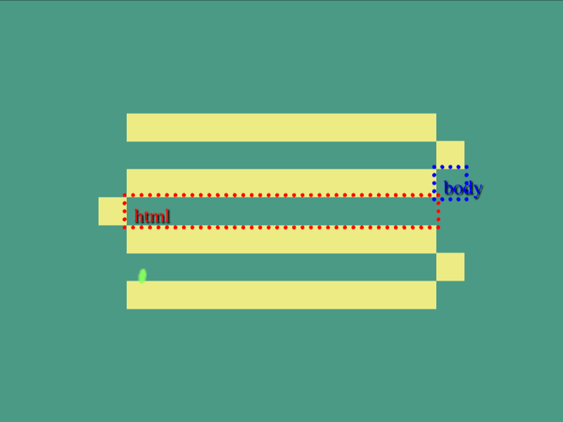

# Daily Target — Sep 4, 2026

Challenge: <https://cssbattle.dev/play/IIybN3XMPLYHSO3ij2ge>

## Result

<table>
	<tr>
		<th width="50%">User Submission</th>
		<th width="50%">Target</th>
	</tr>
	<tr>
		<td width="50%" align="center">
			
		</td>
		<td width="50%" align="center">
			
		</td>
	</tr>
</table>

## Code

```html
<style>*{margin:35%90;color:EDEC84;background:#4a9a86;*{margin:-20-20 20 220;--s:-60vw 5vw}box-shadow:0-5vw,0 63q,var(--s,0 5vw,0-63q
```

## Prettified code

```html
<style>
* {
  margin: 35% 90;
  color: EDEC84;
  background: #4a9a86;
  * {
    margin: -20 -20 20 220;
    --s: -60vw 5vw;
  }
  box-shadow:
    0 -5vw,
    0 63Q,
    var(--s, 0 5vw, 0 -63Q);
}

</style>
```
