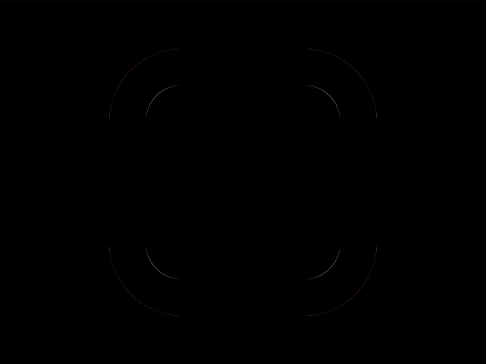

# Daily Target — Sep 5, 2026

Challenge: <https://cssbattle.dev/play/PBllh6aGfOPa9BtjR5m1>

## Result

<table>
	<tr>
		<th width="50%">User Submission</th>
		<th width="50%">Target</th>
	</tr>
	<tr>
		<td width="50%" align="center">
			
		</td>
		<td width="50%" align="center">
			
		</td>
	</tr>
</table>

## Code

```html
<style>
&{
  border: 32q solid;
  border-radius:63q;
  margin:40 90;
  outline: 9in solid #F8B140;
  *{
    margin:40 130 40 -30;
    border-inline:32q solid;
    border-left-color:#F8B140;
  }
  
}
```

## Prettified code

```html
<style>
&{
  border: 32q solid;
  border-radius:63q;
  margin:40 90;
  outline: 9in solid #F8B140;
  *{
    margin:40 130 40 -30;
    border-inline:32q solid;
    border-left-color:#F8B140;
  }
  
}
```
