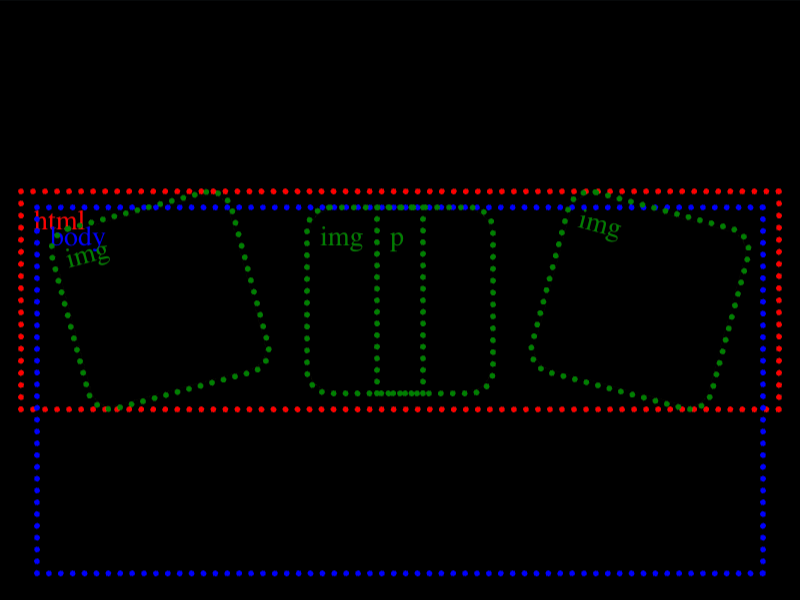

# Daily Target — Sep 6, 2026

Challenge: <https://cssbattle.dev/play/WfbQAGPzXCTFkJjKBxhZ>

## Result

<table>
	<tr>
		<th width="50%">User Submission</th>
		<th width="50%">Target</th>
	</tr>
	<tr>
		<td width="50%" align="center">
			
		</td>
		<td width="50%" align="center">
			
		</td>
	</tr>
</table>

## Code

```html
<p r=0><style>&{margin:97 12}*{rotate:attr(r deg)}img{margin:0 15;background:#6D57C4;padding:45;border-radius:10px}p{background:#FFF;height:90;margin:-90 170
```

## Prettified code

```html
<p r=0>
<style>
& {
  margin: 97 12;
}
* {
  rotate: attr(r deg);
}
img {
  margin: 0 15;
  background: #6d57c4;
  padding: 45;
  border-radius: 10px;
}
p {
  background: #fff;
  height: 90;
  margin: -90 170;
}
</style>
```
