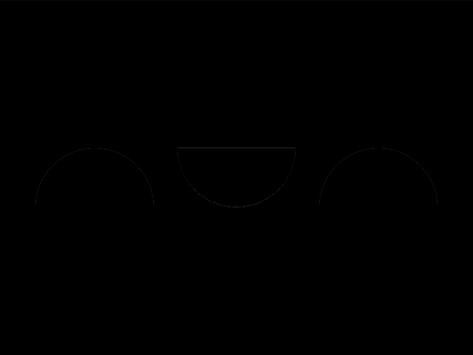

# Daily Target — Sep 7, 2026

Challenge: <https://cssbattle.dev/play/VxH9v8gyndTt19Z4EkeY>

## Result

<table>
	<tr>
		<th width="50%">User Submission</th>
		<th width="50%">Target</th>
	</tr>
	<tr>
		<td width="50%" align="center">
			
		</td>
		<td width="50%" align="center">
			
		</td>
	</tr>
</table>

## Code

```html
<style>&{background:radial-gradient(1q at top,#2f6193 53q,#0000)0 132q,-5ch 185q/60%radial-gradient(1q at bottom,#fff 53q,#84b9ef
```

## Prettified code

```html
<style>
& {
  background:
    radial-gradient(1Q at top, #2f6193 53Q, transparent) 0 132Q,
    -5ch 185Q / 60% radial-gradient(1Q at bottom, #fff 53Q, #84b9ef);
}

</style>
```
