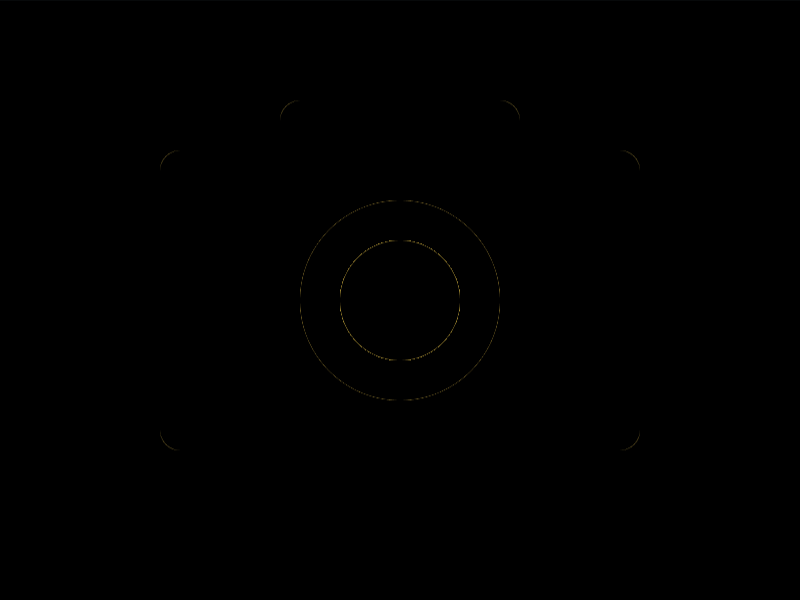

# Daily Target — Sep 8, 2026

Challenge: <https://cssbattle.dev/play/YaO5dVF3I9R870zMutcX>

## Result

<table>
	<tr>
		<th width="50%">User Submission</th>
		<th width="50%">Target</th>
	</tr>
	<tr>
		<td width="50%" align="center">
			
		</td>
		<td width="50%" align="center">
			
		</td>
	</tr>
</table>

## Code

```html
<style>*{border-radius:11q}&{margin:75 80;box-shadow:0 0 0 9in#f1d36f;*{background:#333;margin:-25 60 130}background:radial-gradient(1q,#333 32q,#f1d36f 0 53q,#333
```

## Prettified code

```html
<style>
* {
  border-radius: 11Q;
}
& {
  margin: 75 80;
  box-shadow: 0 0 0 9in #f1d36f;
  * {
    background: #333;
    margin: -25 60 130;
  }
  background: radial-gradient(1Q, #333 32Q, #f1d36f 0 53Q, #333);
}

</style>
```
