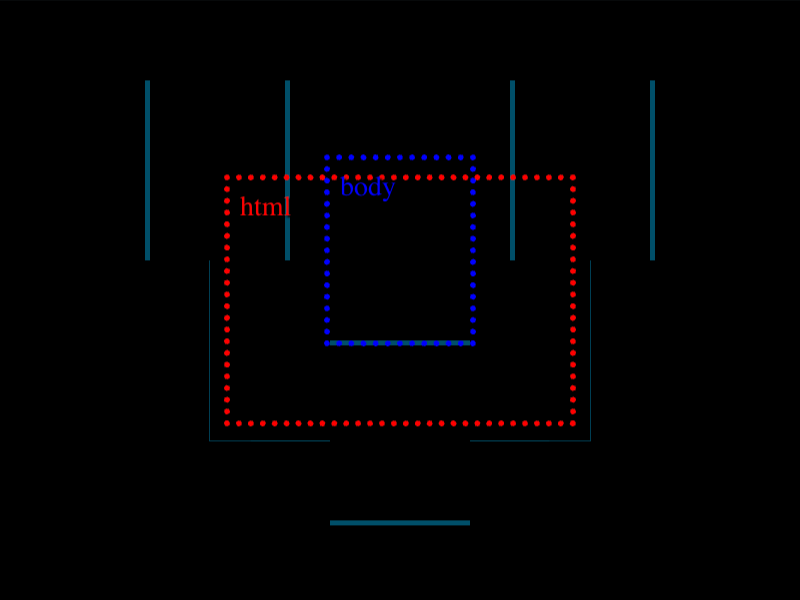

# Daily Target — Sep 9, 2026

Challenge: <https://cssbattle.dev/play/hvkmKnqoppnQEVdc4GkH>

## Result

<table>
	<tr>
		<th width="50%">User Submission</th>
		<th width="50%">Target</th>
	</tr>
	<tr>
		<td width="50%" align="center">
			
		</td>
		<td width="50%" align="center">
			
		</td>
	</tr>
</table>

## Code

```html
<style>&{background:#328fc1;box-shadow:-11q 11q,11q 11q;color:3B3F58;margin:90 115;*{margin:-10 50 40;box-shadow:-5lh -5ch,5lh -5ch,0 5lh
```

## Prettified code

```html
<style>
& {
  background: #328fc1;
  box-shadow:
    -11Q 11Q,
    11Q 11Q;
  color: 3B3F58;
  margin: 90 115;
  * {
    margin: -10 50 40;
    box-shadow:
      -5lh -5ch,
      5lh -5ch,
      0 5lh;
  }
}

</style>
```
