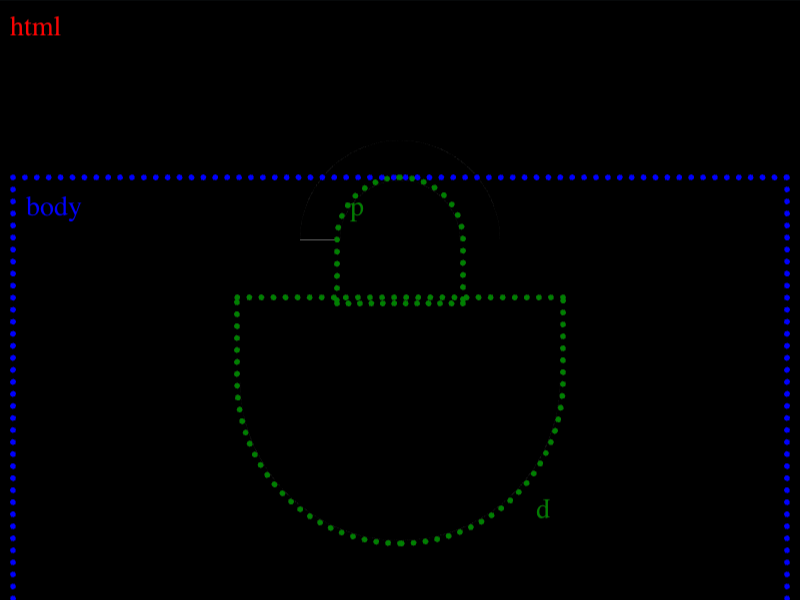

# Daily Target — Sep 10, 2026

Challenge: <https://cssbattle.dev/play/YdSTFgl2iKzGCW1ahmEz>

## Result

<table>
	<tr>
		<th width="50%">User Submission</th>
		<th width="50%">Target</th>
	</tr>
	<tr>
		<td width="50%" align="center">
			
		</td>
		<td width="50%" align="center">
			
		</td>
	</tr>
</table>

## Code

```html
<p><p><style>p{margin:90 162;height:60;border-radius:9in 9in 0 0;box-shadow:0 0 0 5vw#333;+p{margin:-90 112;scale:-1;height:120;box-shadow:inset 2in 2in#333,60q 32q#FFF
```

## Prettified code

```html
<p><p>
<style>
p {
  margin: 90 162;
  height: 60;
  border-radius: 9in 9in 0 0;
  box-shadow: 0 0 0 5vw #333;
  + p {
    margin: -90 112;
    scale: -1;
    height: 120;
    box-shadow:
      inset 2in 2in #333,
      60Q 32Q #fff;
  }
}
</style>
```
