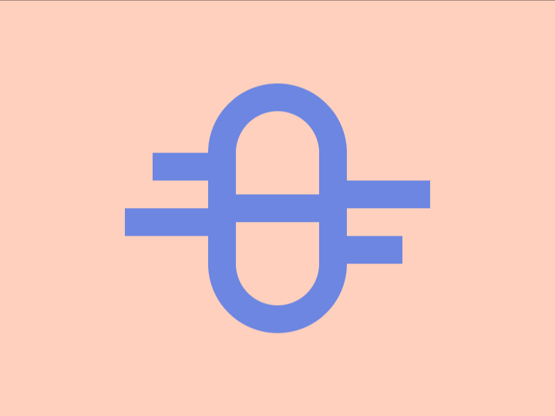

# Daily Target — Sep 11, 2026

Challenge: <https://cssbattle.dev/play/7vxnmvdZG5jOA5grQWZT>

## Result

<table>
	<tr>
		<th width="50%">User Submission</th>
		<th width="50%">Target</th>
	</tr>
	<tr>
		<td width="50%" align="center">
			
		</td>
		<td width="50%" align="center">
			
		</td>
	</tr>
</table>

## Code

```html
<p><style>&{background:#FFD0BD;>*{border-radius:9in;border:5vw solid}*{color:6B86E1;margin:60 150;*{height:20;margin:30 0;box-shadow:-60px 0,0 30px,5pc 5vw,-5pc 5ch,60px 60px
```

## Prettified code

```html
<p>
<style>
& {
  background: #ffd0bd;
  > * {
    border-radius: 9in;
    border: 5vw solid;
  }
  * {
    color: 6B86E1;
    margin: 60 150;
    * {
      height: 20;
      margin: 30 0;
      box-shadow:
        -60px 0,
        0 30px,
        5pc 5vw,
        -5pc 5ch,
        60px 60px;
    }
  }
}
</style>
```
