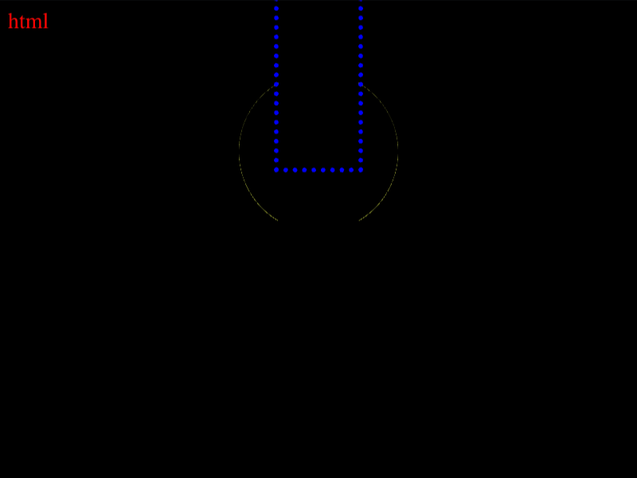

# Daily Target — Sep 12, 2026

Challenge: <https://cssbattle.dev/play/xINN7erbUm2K2I0zG5YF>

## Result

<table>
	<tr>
		<th width="50%">User Submission</th>
		<th width="50%">Target</th>
	</tr>
	<tr>
		<td width="50%" align="center">
			
		</td>
		<td width="50%" align="center">
			
		</td>
	</tr>
</table>

## Code

```html
<style>&{*{margin:105 175 45;background:#F5E3B5;box-shadow:0-5pc#1D025E}background:radial-gradient(1q at 50%95px,#F5E3B5 53q,#1D025E
```

## Prettified code

```html
<style>
& {
  * {
    margin: 105 175 45;
    background: #f5e3b5;
    box-shadow: 0 -5pc #1d025e;
  }
  background: radial-gradient(1Q at 50% 95px, #f5e3b5 53Q, #1d025e);
}

</style>
```
