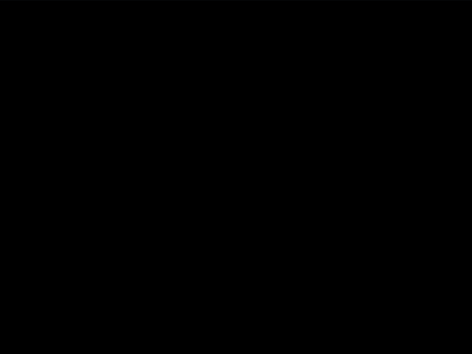

# Daily Target — Sep 13, 2026

Challenge: <https://cssbattle.dev/play/cubFEvfArqYmYhs3IHF4>

## Result

<table>
	<tr>
		<th width="50%">User Submission</th>
		<th width="50%">Target</th>
	</tr>
	<tr>
		<td width="50%" align="center">
			
		</td>
		<td width="50%" align="center">
			
		</td>
	</tr>
</table>

## Code

```html
<style>&{background:#7253BC;border-left:20px solid#391B1B;margin:35 130;*{background:white;margin:10 0 100-20;border:20px solid#391B1B;border-radius:0 60px/20px;corner-shape:notch
```

## Prettified code

```html
<style>
& {
  background: #7253bc;
  border-left: 20px solid #391b1b;
  margin: 35 130;
  * {
    background: white;
    margin: 10 0 100 -20;
    border: 20px solid #391b1b;
    border-radius: 0 60px / 20px;
    corner-shape: notch;
  }
}

</style>
```
