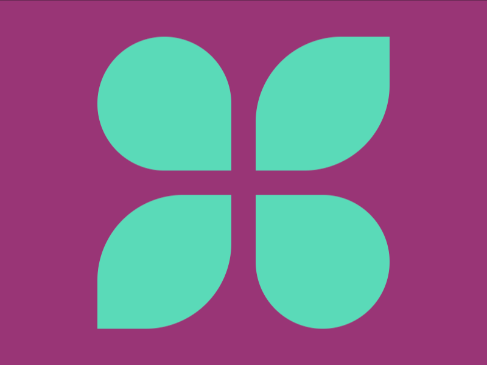

# Daily Target — Sep 15, 2026

Challenge: <https://cssbattle.dev/play/5ZezM7kuEUF3qoAOjCIx>

## Result

<table>
	<tr>
		<th width="50%">User Submission</th>
		<th width="50%">Target</th>
	</tr>
	<tr>
		<td width="50%" align="center">
			
		</td>
		<td width="50%" align="center">
			
		</td>
	</tr>
</table>

## Code

```html
<style>&{background:#993576}img{margin:22-52-2 72;background:#5adab8;padding:55;border-radius:var(--b,64%)0}[b]{--b:64%64%;~ [b]{scale:-1
```

## Prettified code

```html

<style>
& {
  background: #993576;
}
img {
  margin: 22 -52 -2 72;
  background: #5adab8;
  padding: 55;
  border-radius: var(--b, 64%) 0;
}
[b] {
  --b: 64% 64%;
  ~ [b] {
    scale: -1;
  }
}
</style>
```
