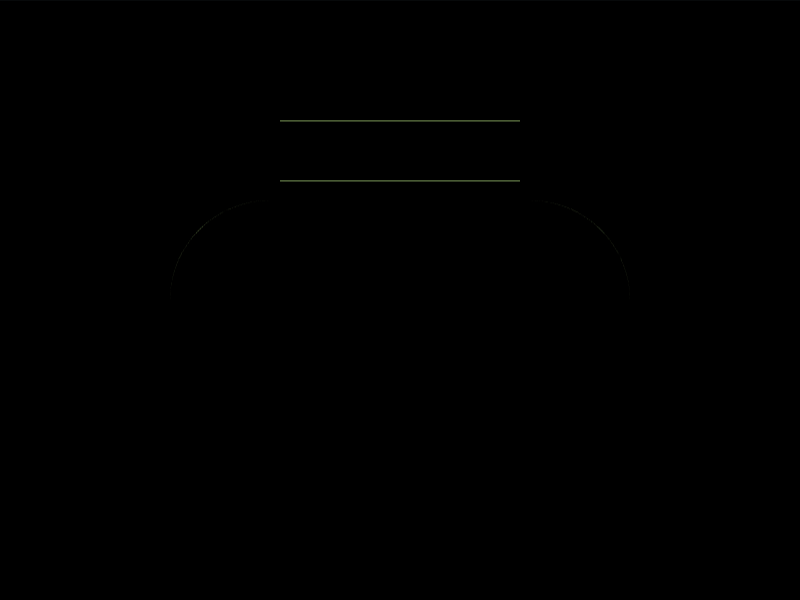

# Daily Target — Sep 16, 2026

Challenge: <https://cssbattle.dev/play/4p0BAlG4T8ddxGUbcOhn>

## Result

<table>
	<tr>
		<th width="50%">User Submission</th>
		<th width="50%">Target</th>
	</tr>
	<tr>
		<td width="50%" align="center">
			
		</td>
		<td width="50%" align="center">
			
		</td>
	</tr>
</table>

## Code

```html
<p h=50><p h=0 y=-190><style>&,p{background:#FAE29E;*{height:attr(h px,0);border:solid#743F3F;border-width:20 10 10}&>*{border-width:50;margin:25%85;border-radius:53q 53q 0 0;*{margin:5;translate:0 attr(y q,-5px
```

## Prettified code

```html
<p h=50><p h=0 y=-190>
<style>
&,
p {
  background: #fae29e;
  * {
    height: attr(h px, 0);
    border: solid #743f3f;
    border-width: 20 10 10;
  }
  & > * {
    border-width: 50;
    margin: 25% 85;
    border-radius: 53Q 53Q 0 0;
    * {
      margin: 5;
      translate: 0 attr(y q, -5px);
    }
  }
}
</style>
```
