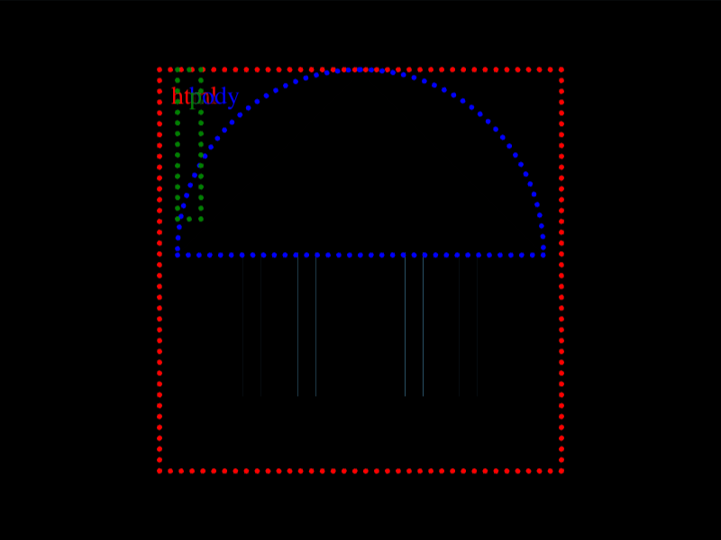

# Daily Target — Sep 17, 2026

Challenge: <https://cssbattle.dev/play/FI82QbLNuW9WtU2AemyW>

## Result

<table>
	<tr>
		<th width="50%">User Submission</th>
		<th width="50%">Target</th>
	</tr>
	<tr>
		<td width="50%" align="center">
			
		</td>
		<td width="50%" align="center">
			
		</td>
	</tr>
</table>

## Code

```html
<p><p><style>&{margin:40 90;background:#7ec3e8;border-bottom:5ch solid#333;>*{margin:0 10 180;background:#333;border-radius:9in 9in 0 0;corner-shape:bevel;p{border:11q solid#333;height:80;margin:0 35;translate:0 95Q;+p{margin:-100 65
```

## Prettified code

```html
<p><p>
<style>
& {
  margin: 40 90;
  background: #7ec3e8;
  border-bottom: 5ch solid #333;
  > * {
    margin: 0 10 180;
    background: #333;
    border-radius: 9in 9in 0 0;
    corner-shape: bevel;
    p {
      border: 11Q solid #333;
      height: 80;
      margin: 0 35;
      translate: 0 95Q;
      + p {
        margin: -100 65;
      }
    }
  }
}
</style>
```
