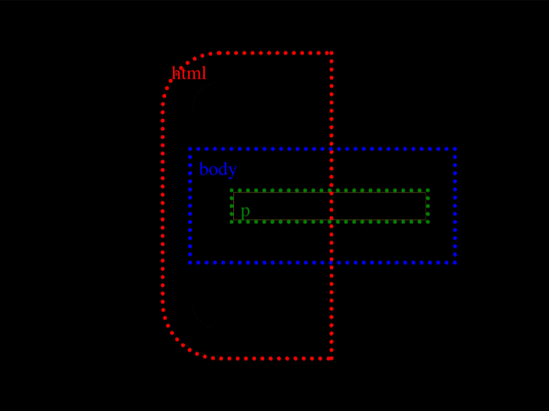

# Daily Target — Sep 18, 2026

Challenge: <https://cssbattle.dev/play/bgsT1tukudFAfXdKJGD2>

## Result

<table>
	<tr>
		<th width="50%">User Submission</th>
		<th width="50%">Target</th>
	</tr>
	<tr>
		<td width="50%" align="center">
			
		</td>
		<td width="50%" align="center">
			
		</td>
	</tr>
</table>

## Code

```html
<p><style>&{border-radius:5ch 0 0 5ch}*{background:#4C4C6B;border:solid#FAE29E;border-width:20 0 20 20;margin:40 160 40 120;*{border-width:0 20 0 0;margin:50-90 50 0;*{width:120;border-width:10;translate:32q 32q
```

## Prettified code

```html
<p>
<style>
& {
  border-radius: 5ch 0 0 5ch;
}
* {
  background: #4c4c6b;
  border: solid #fae29e;
  border-width: 20 0 20 20;
  margin: 40 160 40 120;
  * {
    border-width: 0 20 0 0;
    margin: 50 -90 50 0;
    * {
      width: 120;
      border-width: 10;
      translate: 32Q 32Q;
    }
  }
}
</style>
```
