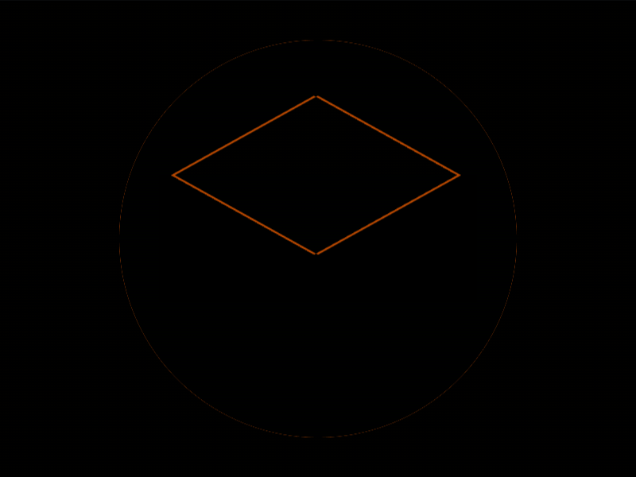

# Daily Target — Sep 19, 2026

Challenge: <https://cssbattle.dev/play/LXVlYbdUHfOS5mrqkEh0>

## Result

<table>
	<tr>
		<th width="50%">User Submission</th>
		<th width="50%">Target</th>
	</tr>
	<tr>
		<td width="50%" align="center">
			
		</td>
		<td width="50%" align="center">
			
		</td>
	</tr>
</table>

## Code

```html
<p><style>&{background:radial-gradient(1q,#FFA173 125px,#485993 0);*{margin:110 100;background:#485993;height:80;*{height:100;width:180;translate:-5lh -50px;background:linear-gradient(#485993 50%,#FFA173 0);corner-shape:bevel;border-radius:100%
```

## Prettified code

```html
<p>
<style>
& {
  background: radial-gradient(1Q, #ffa173 125px, #485993 0);
  * {
    margin: 110 100;
    background: #485993;
    height: 80;
    * {
      height: 100;
      width: 180;
      translate: -5lh -50px;
      background: linear-gradient(#485993 50%, #ffa173 0);
      corner-shape: bevel;
      border-radius: 100%;
    }
  }
}
</style>
```
