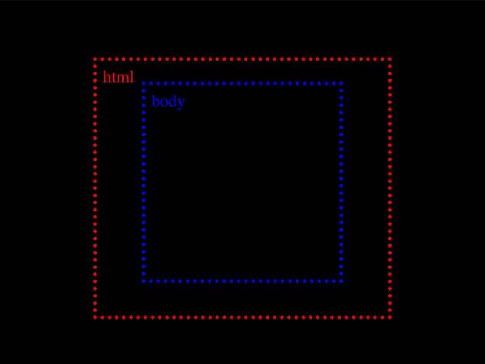

# Daily Target — Sep 20, 2026

Challenge: <https://cssbattle.dev/play/2R2qUfqneVtkaggWFkh5>

## Result

<table>
	<tr>
		<th width="50%">User Submission</th>
		<th width="50%">Target</th>
	</tr>
	<tr>
		<td width="50%" align="center">
			
		</td>
		<td width="50%" align="center">
			
		</td>
	</tr>
</table>

## Code

```html
<style>&{box-shadow:-30vw 25vw 0-25vw,30vw 25vw 0-25vw}*{color:#FEE190;margin:50 80 40;background:#51A499;border:solid;border-width:0 40;*{margin:20 0 30;border-width:40 0
```

## Prettified code

```html
<style>
& {
  box-shadow:
    -30vw 25vw 0 -25vw,
    30vw 25vw 0 -25vw;
}
* {
  color: #fee190;
  margin: 50 80 40;
  background: #51a499;
  border: solid;
  border-width: 0 40;
  * {
    margin: 20 0 30;
    border-width: 40 0;
  }
}

</style>
```
