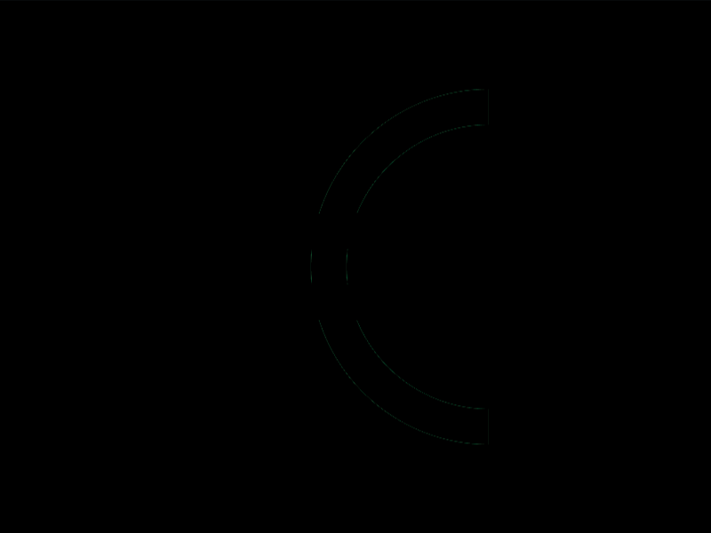

# Daily Target — Sep 21, 2026

Challenge: <https://cssbattle.dev/play/tcjIrX3hxT2bt6WNY8xB>

## Result

<table>
	<tr>
		<th width="50%">User Submission</th>
		<th width="50%">Target</th>
	</tr>
	<tr>
		<td width="50%" align="center">
			
		</td>
		<td width="50%" align="center">
			
		</td>
	</tr>
</table>

## Code

```html
<style>&{background:radial-gradient(1Q at 100%,#1d025e 5pc,#469dba 0 25vw,#1d025e)291Q;*{margin:30%155 30%125;border-top:64q double#469dba
```

## Prettified code

```html
<style>
& {
  background: radial-gradient(1Q at 100%, #1d025e 5pc, #469dba 0 25vw, #1d025e)
    291Q;
  * {
    margin: 30% 155 30% 125;
    border-top: 64Q double #469dba;
  }
}

</style>
```
