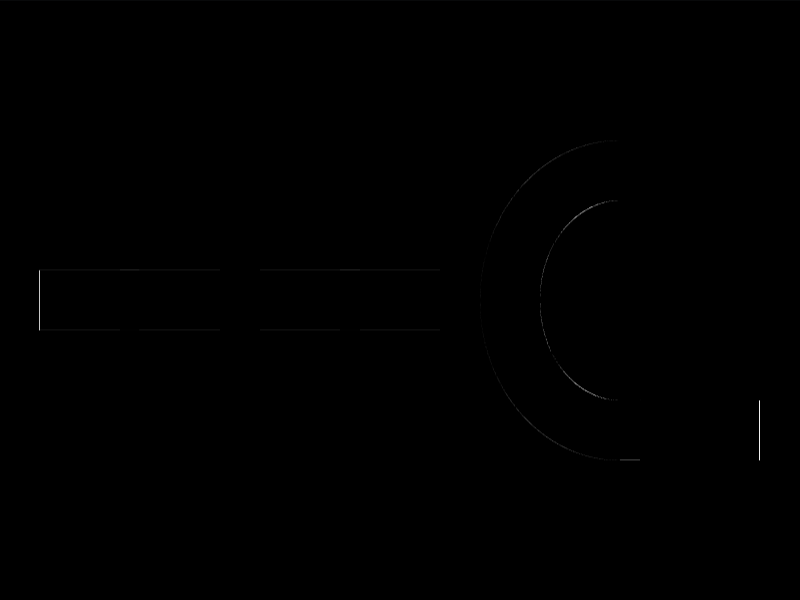

# Daily Target — Sep 28, 2026

Challenge: <https://cssbattle.dev/play/sPBh2rqUt3ilhlL5Rdhj>

## Result

<table>
	<tr>
		<th width="50%">User Submission</th>
		<th width="50%">Target</th>
	</tr>
	<tr>
		<td width="50%" align="center">
			
		</td>
		<td width="50%" align="center">
			
		</td>
	</tr>
</table>

## Code

```html
<p><h5><style>&>*{margin:70 50 0 240;height:100;border-radius:95%0 0 95%/75%;border:32q solid;*{height:30;box-shadow:-265q 37q,-70vh 37q,-35vw 37q,-25vw 37q,63q 25vw}h5{margin:0 20;box-shadow:5vw 57q#fff
```

## Prettified code

```html
<p><h5>
<style>
& > * {
  margin: 70 50 0 240;
  height: 100;
  border-radius: 95% 0 0 95% / 75%;
  border: 32Q solid;
  * {
    height: 30;
    box-shadow:
      -265Q 37Q,
      -70vh 37Q,
      -35vw 37Q,
      -25vw 37Q,
      63Q 25vw;
  }
  h5 {
    margin: 0 20;
    box-shadow: 5vw 57Q #fff;
  }
}
</style>
```
