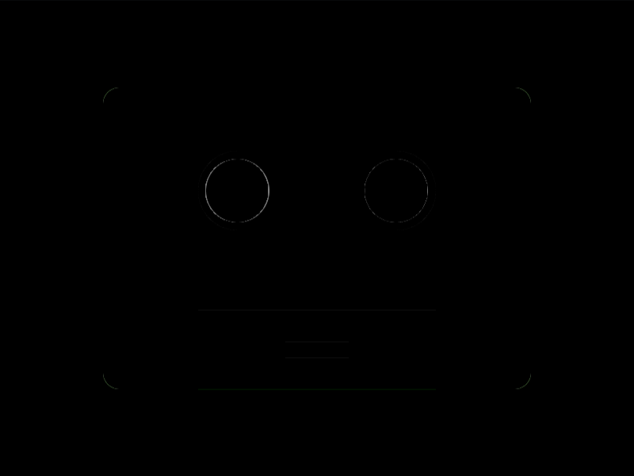

# Daily Target — Oct 1, 2026

Challenge: <https://cssbattle.dev/play/2T06JBTudrVtVc9pONU7>

## Result

<table>
	<tr>
		<th width="50%">User Submission</th>
		<th width="50%">Target</th>
	</tr>
	<tr>
		<td width="50%" align="center">
			
		</td>
		<td width="50%" align="center">
			
		</td>
	</tr>
</table>

## Code

```html
<p>
<style>
& {
  outline: 9in solid #7dcb61;
  background: #d9d9d9;
  margin: 55 65;
  border-radius: 11Q;
  border: solid #454545;
  border-width: 15 15 75;
  
  p {
    height: 10;
    translate: 0 106q;
    border: solid #727272;
    border-width: 20 55;
  }
  
}
</style>
```

## Prettified code

```html
<p>
<style>
& {
  outline: 9in solid #7dcb61;
  background: #d9d9d9;
  margin: 55 65;
  border-radius: 11Q;
  border: solid #454545;
  border-width: 15 15 75;
  
  p {
    height: 10;
    translate: 0 106q;
    border: solid #727272;
    border-width: 20 55;
  }
  
}
</style>
```
