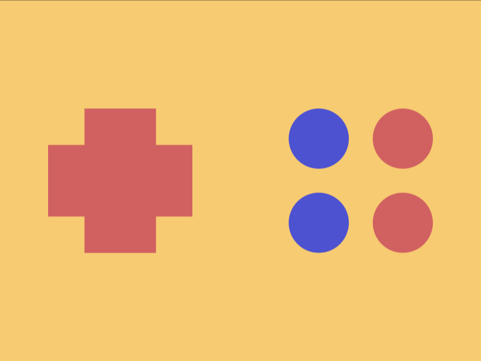

# Daily Target — Oct 5, 2026

Challenge: <https://cssbattle.dev/play/kKeIFq1dBXUmV9k1c7d0>

## Result

<table>
	<tr>
		<th width="50%">User Submission</th>
		<th width="50%">Target</th>
	</tr>
	<tr>
		<td width="50%" align="center">
			
		</td>
		<td width="50%" align="center">
			
		</td>
	</tr>
</table>

## Code

```html
<style>&{corner-shape:notch}*{margin:90 60%90 40;color:D16161;border-radius:32q;*{margin:0-200 70 270;--s:0 74q,-74q 0#4d52d0,-74q 74q#4d52d0}box-shadow:inset 2in 0,var(--s,0 0 0 3in#f7cb71
```

## Prettified code

```html
<style>
& {
  corner-shape: notch;
}
* {
  margin: 90 60% 90 40;
  color: D16161;
  border-radius: 32Q;
  * {
    margin: 0 -200 70 270;
    --s: 0 74Q, -74Q 0 #4d52d0, -74Q 74Q #4d52d0;
  }
  box-shadow:
    inset 2in 0,
    var(--s, 0 0 0 3in #f7cb71);
}

</style>
```
